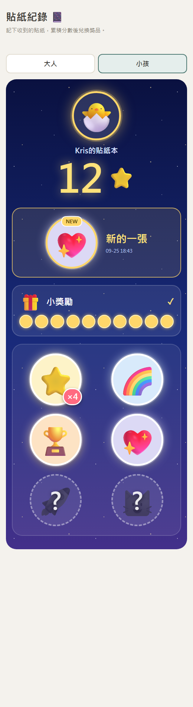
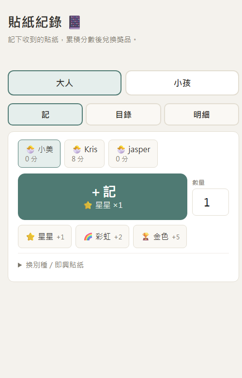

# Sticker Collector 貼紙收集本

> 家庭貼紙集點本：大人 10 秒記一筆，小孩自己翻貼紙簿，集滿換約好的獎勵。
> Family sticker book: parents log in 10 seconds, kids browse their own album, redeem agreed rewards.

 

## 為什麼不一樣

- **雙入口**：大人、小孩入口完全分開，小孩零迷路（認圖不認字）。
- **貼紙＝具體行為**：每顆貼紙綁一個行動（收玩具、準時睡），不是「你很乖」。
- **定時開店**：大獎兩週開一次店，稀缺節奏＋批量兌換儀式。
- **去 AI 感父母頁**：冰箱門佈告欄（拍立得卡＋打孔列＋磁鐵鈕），零漸層零陰影。
- **先模擬再寫功能**：8 週四人物誌跑完，才決定做存錢筒（小獎會吃掉大獎的路）。

## 怎麼跑

```bash
cd backend && PORT=8011 python sticker_api.py
# 大人頁 http://localhost:8011/ ｜ 小孩頁 http://localhost:8011/?view=kid
python backend/test_store.py && python backend/test_demo_data.py
```

單檔前端、零框架、後端純標準庫。資料 `backend/data.json`（demo 數據）。

## 開發方式

腦手分離＋跨模型審查＋模擬先行：先跑 8 週四人物誌模擬，才決定功能優先級；同一份程式換模型家族獨立審查，過了才合併。

## Roadmap

M0–M2 ✅（雙視圖／收集感資料層）→ M3 ✅（行為貼紙＋開店）→ M3.5 🎯（冰箱門＋存錢筒＋SQLite＋上線）→ M4（全對倍數＋集滿儀式）→ M5（PWA＋部署）。

## License

MIT
